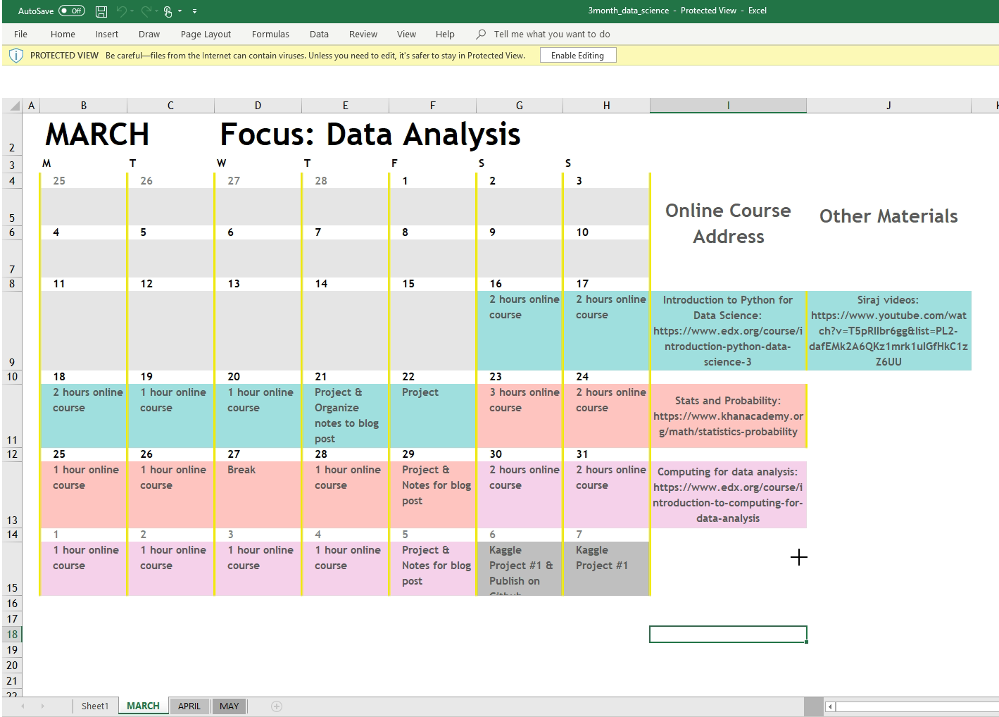

This repo contains all the work I have been doing while deepening my knowledge of Data Science with python.

This project actually started because of my deep interest in Statistics and Machine Learning and I will be posting
content over time and updating it.

### Why did I start
Actually I always had a certain knowledge of the tools and technology out there but I did not believe it was 
as deep (Deep Learning pun?) as I could be.

# Starting Point
My initial Starting point came after watching a Data Science Bootcamp video created by Siraj on youtube.
In actuality I am not fully following the video step by step because I do have previous knowledge of certain statistical concepts
and programming experience in Python so I modify my experience (switch certain coursers or books for others) as I progress.

video
<iframe width="560" height="315" src="https://www.youtube.com/embed/9rDhY1P3YLA" frameborder="0" allow="accelerometer; autoplay; encrypted-media; gyroscope; picture-in-picture" allowfullscreen></iframe>

A link to the inital outline mentioned in the video can be found here. 
[3 Month Data Science Outline](3month_data_science.xlsx)

# Week 1

For week one I spent some time brushing up on the videos presented

