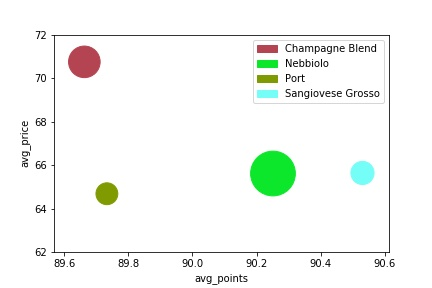
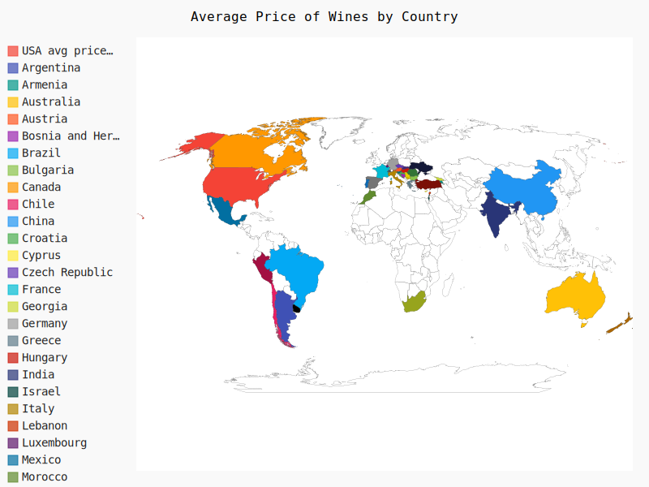

This repo contains all the work I have been doing while deepening my knowledge of Data Science with python.

This project actually started because of my deep interest in Statistics and Machine Learning and I will be posting
content over time and updating it.

### Why did I start
Actually I always had a certain knowledge of the tools and technology out there but I did not believe it was 
as deep (Deep Learning pun?) as I could be.

# Starting Point
My initial Starting point came after watching a Data Science Bootcamp video created by Siraj on youtube.
Video link can be found here [3 Month Daya Science Bootcamp](https://www.youtube.com/watch?v=9rDhY1P3YLA&t=506s)

In actuality I am not fully following the video step by step because I do have previous knowledge of certain statistical concepts
and programming experience in Python so I modify my experience (switch certain coursers or books for others) as I progress.

A link to the inital outline mentioned in the video can be found here. 
[3 Month Data Science Outline](3month_data_science.xlsx)

# Week 1

For week one I spent some time brushing up on the [Introduction to Python for Data Science](https://courses.edx.org/courses/course-v1:Microsoft+DAT208x+1T2019/course/) course

### Topics covered
- Numpy
- Plotting with Matplotlb
- Control flow with Pandas
  
Although the course did not go deep into these topics it was a great introduction filled with great exercises

by the end of this course we decided to use Pandas to Taggle a well known Kaggle Dataset

[Wine Reviews Dataset](https://www.kaggle.com/zynicide/wine-reviews)

To test our Python skills we used Pandas to filter the data to get revealing insights then used Matplotlib to visualize these results.

The full Project can be found here [Week 1 Pandas for data science](Week_1_Pandas)

for example here is a simple graph of the highest reviewed wines using a scatter plot with x axis for avg points and y axis for avg_price and the total number of reviews was used for the sizes of each bubble.

To add more fun to this project I added a svg of wine countries listed on a map

# Week 3
Week 3 was mostly spent reviewing probability and Statistics provided by Khan Academy. This course was useful for remmembering the specific attributes for different distributions and the formulas used.
As well as give an introduction to Linear Regression in addition to many
many permutation and combinations problems.

https://www.khanacademy.org/math/statistics-probability

# Week 4

Spent Week 4 starting out with the Computing for Data Analysis courses presented by EDX
https://courses.edx.org/courses/course-v1:GTx+CSE6040x+1T2019/course/

this course mainly reviewed concepts learned from previous courses while laying the building blocks to modeling Statisical Algorithms using Python.

One of those algorithms included using Bayes Rule to predict which items of a shopping cart are most likely to appear together.

In addition I wanted to learn more about the matplotlib and pandas API

This desire led me to complete the second course in the Applied Data Science specialization provided on Coursera
https://www.coursera.org/learn/python-plotting?specialization=data-science-python

The assignments here give you alot of freedom to create great visualizations such as

[Week4 Code and Materials](Week_4_Matplotlib_Pandas_Coursera)

